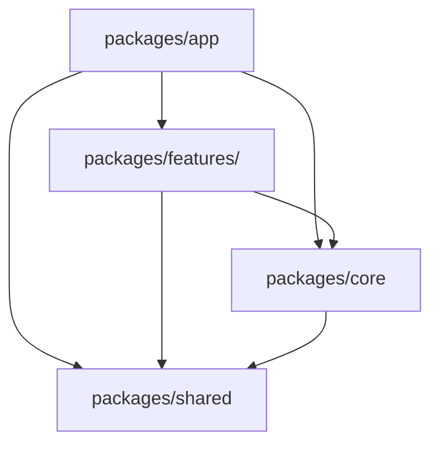

# Flutter Monorepo Architecture with Clean Architecture & MVVM

This document extends the foundational `architecture.md` to specifically address the implementation of a **Flutter Monorepo** structure, integrating **Clean Architecture** and **MVVM** patterns. It provides a comprehensive guide for structuring a large-scale Flutter project, emphasizing modularity, clear separation of concerns, and efficient dependency management across multiple packages within a single repository.

---

## 1. Introduction to Monorepo for Flutter

A monorepo (monolithic repository) is a single repository containing multiple distinct projects, often with well-defined relationships. For Flutter, this means managing multiple Dart/Flutter packages within one Git repository.

### 1.1 Benefits of a Flutter Monorepo

- **Code Sharing**: Easily share code (e.g., `core`, `shared` packages) across different applications or features.
- **Simplified Dependency Management**: All packages are in one place, making it easier to manage inter-package dependencies.
- **Atomic Changes**: Changes affecting multiple packages can be committed in a single transaction, ensuring consistency.
- **Consistent Tooling & Standards**: Enforce uniform linting, formatting, and build processes across all projects.
- **Easier Refactoring**: Refactoring across package boundaries becomes simpler as all code is locally available.

### 1.2 When to Use a Monorepo

A monorepo is particularly beneficial for:

- Large applications with multiple distinct features that can be modularized.
- Organizations building multiple Flutter applications that share common components or business logic.
- Teams aiming for a highly modular and scalable architecture.

---

## 2. Overall Monorepo Project Structure

The monorepo structure introduces a top-level `packages/` directory, which houses all individual Flutter/Dart packages.

```text
.
├── architecture.md             # Original architecture guide
├── architecture-monorepo.md    # This document
├── pubspec.yaml                # Root pubspec (optional, for global tools like Melos)
├── packages/
│   ├── app/                    # The main Flutter application package
│   │   ├── lib/
│   │   │   ├── config/         # Dependency Injection & Environment
│   │   │   │   └── dependencies/ # DI Setup
│   │   │   └── routing/        # Navigation Definitions
│   │   └── ... (standard Flutter project files)
│   ├── core/                   # App-wide core module (Dart package)
│   │   ├── lib/
│   │   │   ├── domain/         # Core Domain Layer
│   │   │   ├── application/    # Core Application Layer
│   │   │   ├── infrastructure/ # Core Infrastructure Layer
│   │   │   └── ui/             # Core Presentation Layer
│   │   └── ... (standard Dart package files)
│   ├── shared/                 # Shared UI components, ViewModels, utils (Dart package)
│   │   ├── lib/
│   │   │   ├── widgets/        # Reusable Widgets (Buttons, Dialogs)
│   │   │   ├── view_models/    # Base/Shared ViewModels
│   │   │   └── utils/          # Helper Functions
│   │   └── ... (standard Dart package files)
│   ├── features/               # Directory for feature-specific modules
│   │   └── <feature_name>/     # e.g., packages/features/home (Flutter/Dart package)
│   │       ├── lib/
│   │       │   ├── domain/     # Domain Layer for this feature
│   │       │   ├── application/ # Application Layer for this feature
│   │       │   ├── infrastructure/ # Infrastructure Layer for this feature
│   │       │   └── ui/         # Presentation Layer for this feature
│   │       └── ... (standard Flutter/Dart package files)
│   └── ... (other packages like data, auth, etc.)
└── ... (other monorepo-level files like melos.yaml)
```

### 2.1 Top-Level Monorepo Dependency Graph

This graph illustrates how the packages within the monorepo depend on each other.



- **`app`**: Depends on `features`, `core`, and `shared`. It orchestrates the entire application.
- **`features/<feature>`**: Each feature package depends on `core` (for core business rules/services) and `shared` (for common UI/utilities). Features should ideally not depend on other features directly to maintain modularity.
- **`core`**: Contains fundamental, app-wide business logic and interfaces. It depends on `shared` for common utilities if needed.
- **`shared`**: Contains truly reusable, generic components (UI, utilities) that have no specific business logic dependencies. It should have minimal to no dependencies on other internal packages.

---

## 3. Package Responsibilities and Internal Structure

Each package within the `packages/` directory adheres to the Clean Architecture and MVVM principles outlined in `architecture.md`.

### 3.1 `packages/app` (Main Application)

This is the main Flutter application that integrates all other packages to form the complete product.

- **Responsibility**: Application entry point, global dependency injection setup, main routing, theme definition, and overall app orchestration.
- **Internal Structure**:

  ```text
  packages/app/lib/
  ├── main.dart
  ├── app.dart                  # Root widget (MyApp)
  ├── config/
  │   └── dependencies/         # Global DI setup (e.g., GetIt, Riverpod providers)
  │       └── setup.dart
  └── routing/                  # Global navigation definitions (e.g., GoRouter setup)
      └── app_router.dart
  ```

- **Example (`packages/app/lib/config/dependencies/setup.dart`)**:

  ```dart
  import 'package:get_it/get_it.dart';
  import 'package:core/core.dart'; // Import core package
  import 'package:shared/shared.dart'; // Import shared package
  import 'package:home/home.dart'; // Import a feature package

  final getIt = GetIt.instance;

  void setupDependencies() {
    // Register core dependencies
    getIt.registerLazySingleton<AuthRepository>(() => AuthRepositoryImpl());
    getIt.registerFactory(() => FetchCurrentUserUseCase(getIt()));

    // Register shared dependencies (if any)
    getIt.registerLazySingleton<LoggingService>(() => LoggingService());

    // Register feature-specific dependencies
    // Example: Home feature's ViewModel and its dependencies
    getIt.registerFactory(() => GetHomeDataUseCase(getIt())); // Assuming GetHomeDataUseCase is in home/application
    getIt.registerFactory(() => HomeViewModel(getIt())); // Assuming HomeViewModel is in home/ui/view_models
  }
  ```

### 3.2 `packages/core` (Core Business Logic)

A Dart package containing app-wide, fundamental business rules, interfaces, and common utilities that are not UI-specific.

- **Responsibility**: Defines core domain models, repository interfaces, application-level use cases, and infrastructure implementations for common services (e.g., authentication, user management, network clients).
- **Internal Structure**: Adheres strictly to the Clean Architecture layers.

  ```text
  packages/core/lib/
  ├── core.dart                 # Export file
  ├── domain/
  │   ├── models/               # User, AppConfig, etc.
  │   ├── repositories/         # AuthRepository (interface)
  │   └── services/             # AuthService (interface)
  ├── application/
  │   └── usecases/             # FetchCurrentUserUseCase
  ├── infrastructure/
  │   ├── data/                 # DioClient, FirebaseClient
  │   ├── repositories/         # AuthRepositoryImpl
  │   └── services/             # LoggingServiceImpl, AnalyticsServiceImpl
  └── ui/                       # Global UI components (e.g., global error dialogs)
      ├── pages/
      ├── view_models/
      └── widgets/
  ```

- **Example (`packages/core/lib/domain/repositories/auth_repository.dart`)**:

  ```dart
  abstract class AuthRepository {
    Future<User?> getCurrentUser();
    Future<bool> login(String username, String password);
    Future<void> logout();
  }
  ```

- **Example (`packages/core/lib/infrastructure/repositories/auth_repository_impl.dart`)**:

  ```dart
  import 'package:core/core.dart'; // Import core's domain layer

  class AuthRepositoryImpl implements AuthRepository {
    // final AuthApi _authApi; // Example: dependency on a data source

    // AuthRepositoryImpl(this._authApi);

    @override
    Future<User?> getCurrentUser() async {
      // Implement fetching current user from API or local storage
      return User('123', 'John Doe');
    }

    @override
    Future<bool> login(String username, String password) async {
      // Implement login logic
      return true;
    }

    @override
    Future<void> logout() async {
      // Implement logout logic
    }
  }
  ```

### 3.3 `packages/shared` (Shared UI & Utilities)

A Dart package for highly reusable UI components, base ViewModels, and general utility functions that are not tied to any specific business domain.

- **Responsibility**: Provides common widgets (buttons, text fields, dialogs), base classes for ViewModels, and helper functions (date formatters, validators).
- **Internal Structure**:

  ```text
  packages/shared/lib/
  ├── shared.dart               # Export file
  ├── widgets/                  # CustomButton, AppDialog
  ├── view_models/              # BaseViewModel (ChangeNotifier)
  └── utils/                    # DateFormatter, Validators
  ```

- **Example (`packages/shared/lib/view_models/base_view_model.dart`)**:

  ```dart
  import 'package:flutter/foundation.dart';

  abstract class BaseViewModel extends ChangeNotifier {
    bool _isLoading = false;
    String? _error;

    bool get isLoading => _isLoading;
    String? get error => _error;

    void setLoading(bool loading) {
      _isLoading = loading;
      notifyListeners();
    }

    void setError(String? msg) {
      _error = msg;
      notifyListeners();
    }
  }
  ```

### 3.4 `packages/features/<feature_name>` (Feature Modules)

Each feature (e.g., `home`, `cart`, `profile`) is its own Flutter/Dart package. This promotes strong modularity and allows features to be developed and tested in isolation.

- **Responsibility**: Encapsulates all logic and UI related to a specific feature. It depends on `core` for shared business rules and `shared` for common UI/utilities.
- **Internal Structure**: Adheres to the Clean Architecture layers, specific to the feature.

  ```text
  packages/features/<feature_name>/lib/
  ├── <feature_name>.dart       # Export file (e.g., home.dart)
  ├── domain/                   # Feature-specific models, repositories, services
  │   ├── models/               # HomeItem, Product
  │   ├── repositories/         # HomeRepository (interface)
  │   └── services/             # HomeDataService (interface)
  ├── application/
  │   └── usecases/             # GetHomeDataUseCase
  ├── infrastructure/
  │   ├── data/                 # HomeApi, HomeLocalDataSource
  │   ├── repositories/         # HomeRepositoryImpl
  │   └── services/             # (if any feature-specific external services)
  └── ui/
      ├── pages/                # HomePage
      ├── view_models/          # HomeViewModel
      └── widgets/              # HomeCard
  ```

- **Example (`packages/features/home/lib/ui/pages/home_page.dart`)**:

  ```dart
  import 'package:flutter/material.dart';
  import 'package:provider/provider.dart';
  import 'package:home/home.dart'; // Import feature's own exports
  import 'package:shared/shared.dart'; // Import shared widgets/view_models

  class HomePage extends StatelessWidget {
    const HomePage({super.key});

    @override
    Widget build(BuildContext context) {
      // Assuming HomeViewModel is provided via GetIt or similar in main app
      final viewModel = Provider.of<HomeViewModel>(context);

      return Scaffold(
        appBar: AppBar(title: const Text('Home')),
        body: Center(
          child: viewModel.isLoading
              ? const CircularProgressIndicator()
              : viewModel.error != null
                  ? Text('Error: ${viewModel.error}')
                  : ListView.builder(
                      itemCount: viewModel.items.length,
                      itemBuilder: (context, index) {
                        final item = viewModel.items[index];
                        return HomeCard(item: item); // HomeCard from home/ui/widgets
                      },
                    ),
        ),
        floatingActionButton: FloatingActionButton(
          onPressed: () => viewModel.loadHomeData(),
          child: const Icon(Icons.refresh),
        ),
      );
    }
  }
  ```

---

## 4. Dependency Management in Monorepo (`pubspec.yaml`)

Within a monorepo, packages depend on each other using `path` dependencies in their `pubspec.yaml` files.

### 4.1 `pubspec.yaml` Example (`packages/app/pubspec.yaml`)

```yaml
name: app
description: The main Flutter application.
publish_to: "none" # Prevents accidental publishing

resolution: workspace

environment:
  sdk: ">=3.0.0 <4.0.0"
  flutter: ">=1.17.0"

dependencies:
  flutter:
    sdk: flutter

  # Internal packages (path dependencies)
  core:
  shared:
  home:

  # External packages
  get_it: ^7.6.0
  provider: ^6.0.5
  go_router: ^13.0.0
  # ... other external dependencies
```

### 4.2 `pubspec.yaml` Example (`packages/features/home/pubspec.yaml`)

```yaml
name: home
description: Home feature module.
publish_to: "none"

resolution: workspace

environment:
  sdk: ">=3.0.0 <4.0.0"
  flutter: ">=1.17.0" # If it contains Flutter UI

dependencies:
  flutter:
    sdk: flutter # Only if it contains Flutter UI

  # Internal packages
  core:
  shared:

  # External packages specific to this feature
  # ...
```

### 4.3 `pubspec.yaml` Example (`packages/core/pubspec.yaml`)

```yaml
name: core
description: Core business logic and common services.
publish_to: "none"

resolution: workspace

environment:
  sdk: ">=3.0.0 <4.0.0"

dependencies:
  # Internal packages (core might depend on shared for utilities)
  shared:

  # External packages specific to core (e.g., http client, data models)
  # ...
```

---

## 5. Best Practices for Flutter Monorepos

- **Strict Dependency Rules**: Enforce the dependency graph (e.g., features should not depend on other features). Use linting rules or custom checks if necessary.
- **Clear Export Files**: Each package's `lib/<package_name>.dart` (e.g., `core.dart`, `home.dart`) should explicitly export only the public APIs.
- **Consistent Naming**: Maintain consistent naming conventions for packages, directories, and files.
- **Version Management**: Decide on a versioning strategy (e.g., independent versioning for each package or a single version for the entire monorepo). Melos supports both.
- **CI/CD Setup**: Configure CI/CD pipelines to build, test, and deploy packages efficiently within the monorepo context.

---

## 7. Conclusion

Adopting a Flutter monorepo with Clean Architecture and MVVM provides a robust, scalable, and maintainable foundation for complex applications. By clearly defining package responsibilities, managing dependencies effectively, and utilizing tools like Melos, development teams can streamline their workflow and build high-quality Flutter products.
